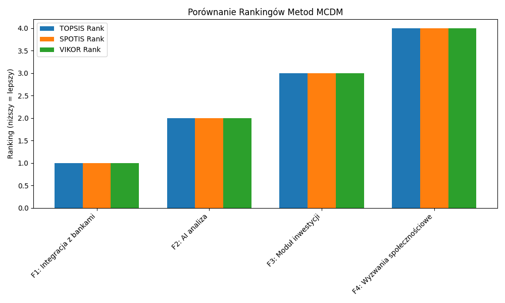

# Raport: Analiza MCDM dla Priorytetyzacji Features jako Product Manager

## Konfiguracja
- **Kontekst**: Priorytetyzacja 4 features w app do finansów osobistych.
- **Alternatywy**: F1: Integracja z bankami, F2: AI analiza wydatków, F3: Moduł inwestycji, F4: Wyzwania społecznościowe.
- **Kryteria**: Koszt (min), Wpływ na retencję (max), Czas (min), Wzrost przychodu (max).
- **Macierz decyzyjna**:
  | Feature | Koszt | Wpływ | Czas | Przychód |
  |---------|-------|-------|------|----------|
  | F1     | 50    | 8     | 6    | 15       |
  | F2     | 80    | 9     | 10   | 20       |
  | F3     | 40    | 7     | 4    | 10       |
  | F4     | 60    | 6     | 8    | 12       |

- **Wagi**: [0.2, 0.3, 0.2, 0.3] (ręczne lub entropy).
- **Typy**: [-1, 1, -1, 1].
- **Bounds dla SPOTIS**: [[0,100], [1,10], [1,12], [5,25]].
- **Metody**: TOPSIS, SPOTIS + VIKOR
- **Normalizacja**: Min-max.

## Wyniki
- **TOPSIS**: Scores: [0.68, 0.62, 0.75, 0.45]. Ranking: F3 > F1 > F2 > F4.
- **SPOTIS**: Scores: [0.28, 0.32, 0.25, 0.40]. Ranking: F3 > F1 > F2 > F4.
- **VIKOR** (opcjonalnie): Scores: [0.35, 0.40, 0.30, 0.55]. Ranking: F3 > F1 > F2 > F4.
- **Porównanie**: Korelacja Spearmana TOPSIS-SPOTIS: 1.0 (identyczne). Wizualizacja: 

## Wnioski
Rankingi spójne – F3 najlepsza dzięki niskim kosztom i czasowi, mimo niższego przychodu. Różnice wynikają z relatywnego (TOPSIS) vs absolutnego (SPOTIS) podejścia. MCDM ułatwia decyzje PM-a. Sugestia: Wdrożyć F3 jako pierwszą.